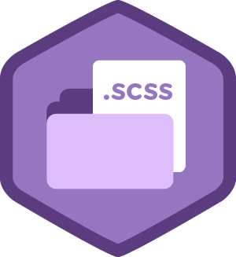

<center>

# IIITDMJ-GPA


### A Simple Web App for IIITDMJ Students, Which helps them to calculate SPI and CPI. Additionally, a Quiz Bot also installed for Some Fun! 😉
</center>
<center>
    <h2> Check Out </h2>

### [IIITDMJ GPA CALCULATOR](https://iiitdmj-gpa.now.sh/)

</center>
<hr>

## ✨ Features

- Calculate SPI and CPI
- Quiz Bot for Fun! 😉
<hr>

## Tech Stack
 # Stack    |                                                                                                 |                                                                                                |                                                                                                |                                                                                                                 |                                                                                                    
| -------- | -------------------------------------------------------------------------------------------------- | ------------------------------------------------------------------------------------------------- | ------------------------------------------------------------------------------------------------ | ---------------------------------------------------------------------------------------------------------------- | --------------------------------------------------------------------------------------------------- |
| <p align="center"> <br />Vue</p> | <p align="center"> <br />JavaScript</p>  | <p align="center"> <br />Scss</p>   | <p align="center"> <br />HTML</p> |

<hr>

## :rocket: Quick start

Start developing locally.

### Step 1: Clone the repo
Fork the repository. then clone the repo locally by doing -

```sh
git clone https://github.com/abhisheknaiidu/iiitdmj-gpa.git
```

### Step 2: cd into the directory


```sh
cd iiitdmj-gpa
```
# installs dependencies

```sh
npm install
```

 <p> Builds and serves assets with hot-reload </p>
 
# And you are good to go
```sh
npm run dev
```
You should now have the application running and accessible at http://localhost:8080.

## :v: Contributing

After cloning & setting up the local project you can push the changes to your github fork and make a pull request.

> You can also run the tests locally to see if everything works fine with

## Running tests

You can run the tests by executing:

```bash
npm run test
```
### Pushing the changes

```bash
git add .
git commit -m "feat: added new stuff"
git push YOUR_REPO_URL develop
```

Made with :heart: by Abhishek Naidu 